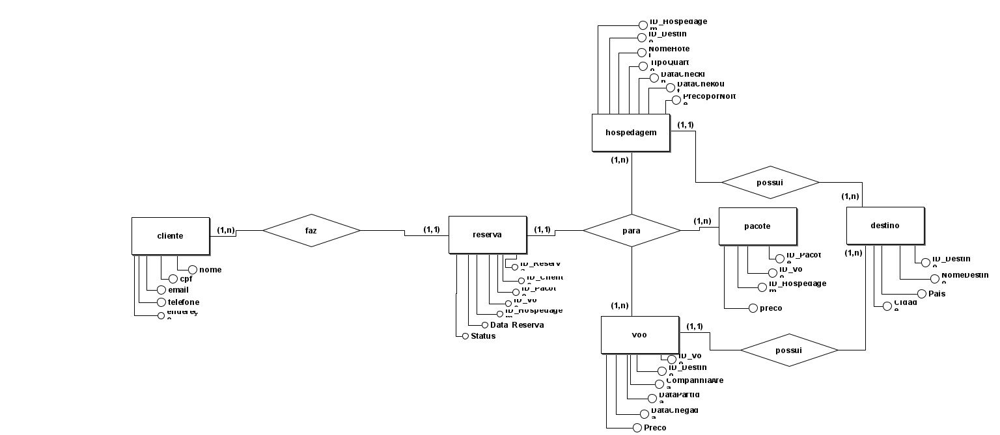
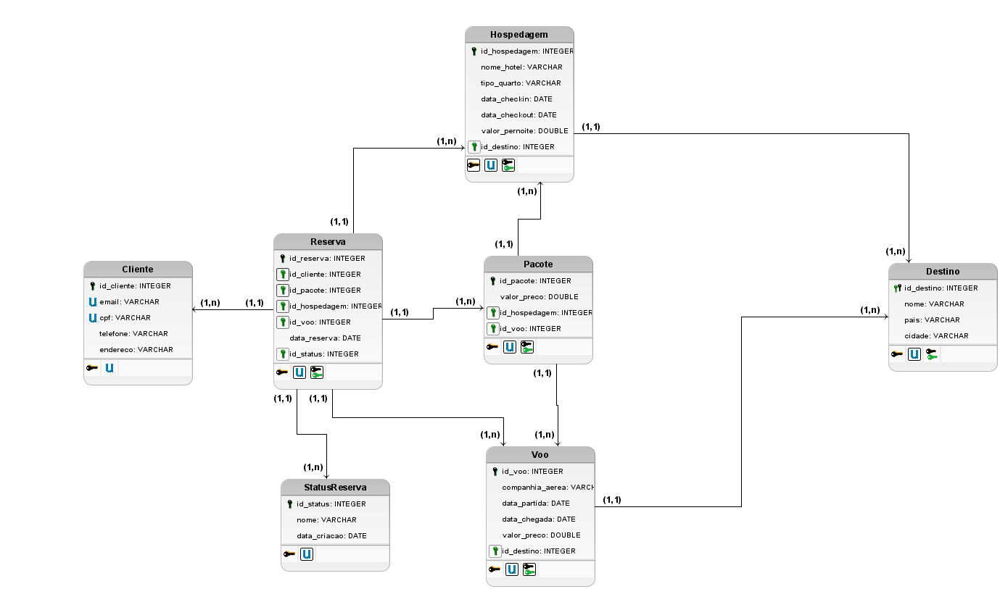
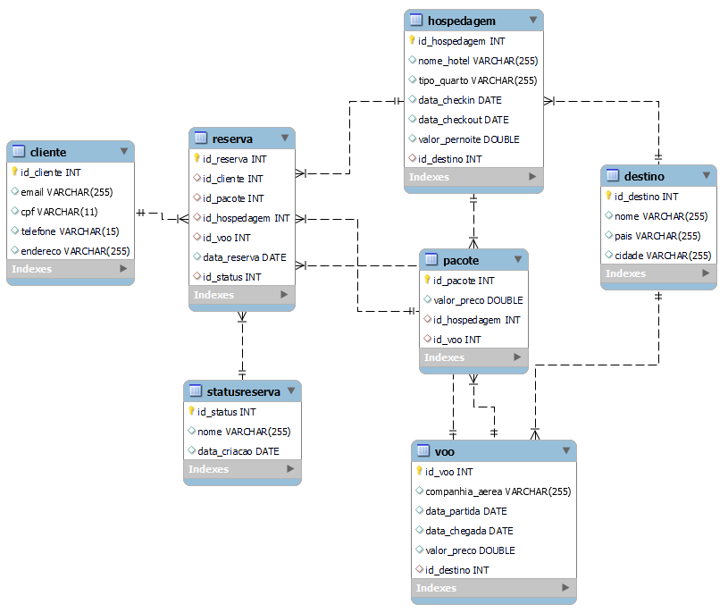

# Back-end do site Rotas do Sol

Rotas do Sol é um site de viagens. Ele foi desenvolvido como atividade integrada do curso de Desenvolvimento Web Full Stack da Recode.

## Modelos e Diagramas

### Modelo Conceitual

### Modelo Lógico

### Modelo Fisico

### Diagrama de Classes

